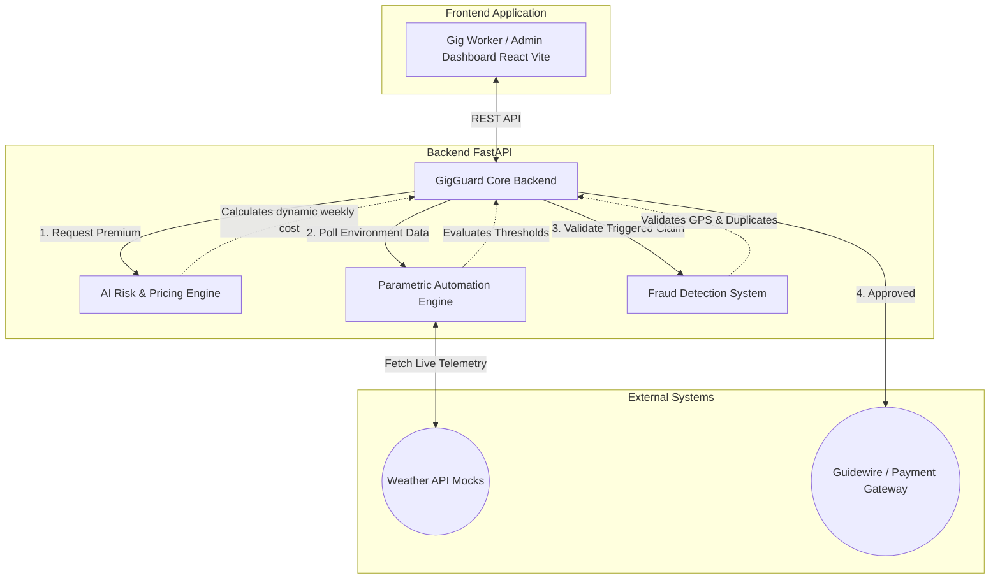

# 🛡️ GigGuard: AI-Powered Insurance for India’s Gig Economy

**GigGuard** is an AI-enabled parametric insurance platform built specifically for India’s delivery partners (Zomato, Swiggy, Zepto, etc.). It safeguards gig workers against income loss caused by uncontrollable external disruptions such as extreme weather, heavy rainfall, heatwaves, or severe pollution.

## 🚀 The Solution
Currently, gig workers bear the full financial loss when extreme environmental or social disruptions occur. GigGuard solves this by providing automated, zero-paperwork coverage structured on a **Weekly Pricing Model**.

### 🌟 Key Features
1. **AI-Powered Risk Assessment:** Calculates dynamic weekly premiums based on the rider's operating zone history, vehicle type risk (EV vs Petrol vs Cycle), and average earnings.
2. **Parametric Automation:** Connects to real-time weather APIs. If predefined thresholds (e.g., > 15mm/hr rain or > 42°C heat) are crossed in the rider's zone, a payout claim is instantly triggered for the lost income.
3. **Intelligent Fraud Detection:** Before authorizing the payout, the system mathematically validates the telematics (GPS location tracking) and runs duplicate-claim prevention algorithms to ensure claim integrity.

---

## 🏗️ Architecture Diagram

---

## 💻 Tech Stack
* **Frontend:** React.js, TypeScript, Vite, Pure CSS (Modern Fintech Glassmorphism Theme)
* **Backend:** Python, FastAPI, Uvicorn, Pydantic
* **AI & Logic:** Pure Python Heuristics (designed for seamless integration with Scikit-Learn/XGBoost in production)

---

## 🔄 Detailed Process Workflow

How does GigGuard solve the problem? Traditional insurance relies on damage assessment, paperwork, and lengthy approval cycles—which do not work for gig workers who rely on daily wages. We solve this using a **Parametric Architecture**, meaning payouts are triggered automatically by live **data parameters** rather than manual damage claims.

### Example Workflow: A Monsoon Flood in Bangalore
Here is how the platform operates end-to-end for a Zomato delivery partner in Whitefield.

#### State 1: Onboarding & Risk Profiling
* **What happens:** The rider logs into their delivery app. The platform securely generates a GigGuard policy for the current week.
* **Our Process:** The AI Risk Engine analyzes historical data. Because the rider operates an **Electric Vehicle (EV)** in the **Whitefield** zone (a known high flood-risk area), the predictive model dynamically calculates a weekly premium of ₹42.00 to cover up to ₹960/day in lost income. The premium is deducted seamlessly from their weekly payout settlement.

#### State 2: Active Monitoring (The Disruption Event)
* **What happens:** A sudden, severe monsoon downpour begins, causing massive waterlogging. Safe movement becomes impossible and the zone is temporarily blocked for deliveries.
* **Our Process:** GigGuard's backend continuously polls an external weather webhook. The telemetry registers rainfall exceeding our predefined threshold of **15 mm/hr**. A Parametric Smart Contract trigger fires instantly. The rider does not need to submit any photos or paperwork to prove they lost work.

#### State 3: Fraud Validation & Instant Payout
* **What happens:** The system verifies the disruption and transfers funds to the rider, protecting their daily wage drop.
* **Our Process:** Before initiating the Guidewire core payment module, the GigGuard Fraud Validation system performs a rapid integrity check. It queries the rider's active GPS coordinates, verifies they were successfully logged into the platform within the affected geography, and ensures no duplicate policy was triggered. Once green-lit, the API instantly executes a bank/UPI transfer.
