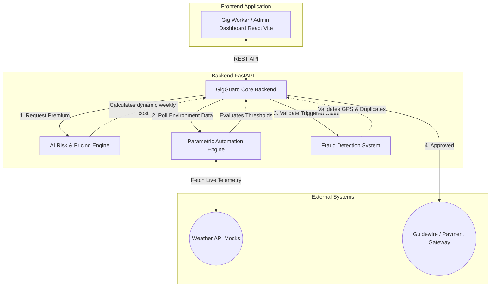

# 🛡️ GigGuard: AI-Powered Insurance for India’s Gig Economy

**GigGuard** is an AI-enabled parametric insurance platform built specifically for India’s delivery partners (Zomato, Swiggy, Zepto, etc.). It safeguards gig workers against income loss caused by uncontrollable external disruptions such as extreme weather, heavy rainfall, heatwaves, or severe pollution.

## 🚀 The Solution
Currently, gig workers bear the full financial loss when extreme environmental or social disruptions occur. GigGuard solves this by providing automated, zero-paperwork coverage structured on a **Weekly Pricing Model**.

### 🌟 Key Features
1. **AI-Powered Risk Assessment:** Calculates dynamic weekly premiums based on the rider's operating zone history, vehicle type risk (EV vs Petrol vs Cycle), and average earnings.
2. **Parametric Automation:** Connects to real-time weather APIs. If predefined thresholds (e.g., > 15mm/hr rain or > 42°C heat) are crossed in the rider's zone, a payout claim is instantly triggered for the lost income.
3. **Intelligent Fraud Detection:** Before authorizing the payout, the system mathematically validates the telematics (GPS location tracking) and runs duplicate-claim prevention algorithms to ensure claim integrity.

---

## 🏗️ Architecture Diagram



---

## 💻 Tech Stack
* **Frontend:** React.js, TypeScript, Vite, Pure CSS (Modern Fintech Glassmorphism Theme)
* **Backend:** Python, FastAPI, Uvicorn, Pydantic
* **AI & Logic:** Pure Python Heuristics (designed for seamless integration with Scikit-Learn/XGBoost in production)

---

## 🛠️ Setup & Local Run Instructions

To run this platform locally, you will need two terminal windows:

### 1. Run the Backend API (Python)
Navigate to the `backend` directory from the root of the project:
```bash
cd backend
python -m venv venv

# On Windows:
.\venv\Scripts\activate
# On Mac/Linux:
source venv/bin/activate

# Install dependencies:
pip install fastapi uvicorn pydantic scikit-learn

# Run the FastAPI server:
uvicorn main:app --reload --port 8000
```
*The backend API console (Swagger UI) will be available at [http://localhost:8000/docs](http://localhost:8000/docs)*

### 2. Run the Frontend UI (React)
Navigate to the `frontend` directory from the root of the project:
```bash
cd frontend

# Install dependencies
npm install

# Start the dev server
npm run dev
```
*The GigGuard platform will be accessible at [http://localhost:5173](http://localhost:5173)*
